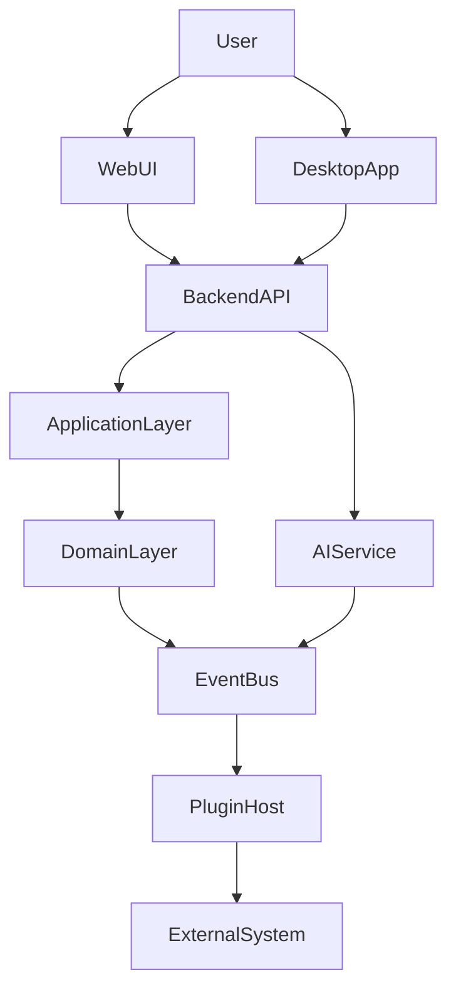

# SYSTEM_ARCHITECTURE

System Architecture는 특정 기술에 종속되지 않는다.

## 1. Architecture Principles

- DDD
- Event Driven
- CQRS
- Hexagonal Architecture
- Plugin First
- AI First
- API First

## 2. System Layers

- Presentation Layer
- Application Layer
- Domain Layer
- Infrastructure Layer
- Plugin Layer
- External Integration Layer
- AI Layer

## 3. Runtime Components

- Web UI
- Desktop App
- Backend API
- AI Service
- Event Bus
- Message Queue
- Scheduler
- Plugin Host
- Storage
- Monitoring
- Authentication
- Media Engine

## 4. External Systems

- Resolume
- Unreal Engine
- OBS
- MIDI
- OSC
- DMX
- Art-Net
- NDI
- WebRTC
- FFmpeg
- Laser Controller
- Projector Controller

## 5. Component Diagram

## 6. Data Flow

User -> Frontend -> API -> Application -> Domain -> Event Bus -> Plugin -> External Device

## 7. Event Flow

SceneActivated -> CueExecuted -> PlaybackStarted -> ResolumeTriggered -> ProjectorOutput

## 8. Deployment Diagram

- Local
- Cloud
- Hybrid
- Offline

## 9. Plugin Communication

- Plugin SDK
- Plugin API
- Plugin Event
- Plugin Lifecycle

## 10. AI Integration

- Prompt Engine
- LLM Provider
- AI Memory
- AI Orchestrator
- AI Agent

## 11. Performance Target

- UI Response <100ms
- Playback Delay <30ms
- Plugin Call <20ms
- Event Propagation <10ms

## 12. Scalability

- Single User
- Small Theater
- Large Theater
- Festival
- Multi Venue
- Cloud

## 13. Security

- Authentication
- Authorization
- Secret Management
- Plugin Sandbox
- Audit Log

## 14. Monitoring

- Metrics
- Tracing
- Structured Logging
- Health Check
- Alert
