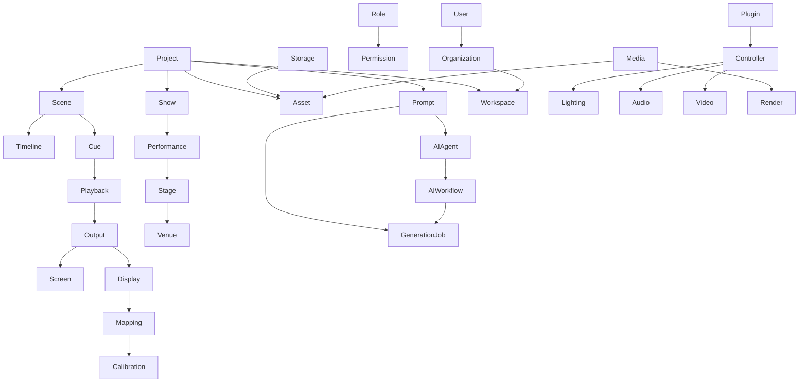

# AGGREGATE_DESIGN

> Aggregate는 데이터 묶음이 아니라 비즈니스 규칙의 경계이다.
> Aggregate 안에서만 상태를 변경할 수 있다.
> 외부에서는 Aggregate Root를 통해서만 접근한다.
> Aggregate는 항상 일관성을 유지해야 한다.

## Project Aggregate

### Responsibility
프로젝트 생명주기/상태/메타 관리.

### Aggregate Root
Project

### Entities
Project

### Value Objects
ProjectId, ProjectName, ProjectStatus

### Domain Services
ProjectService

### Domain Events
ProjectCreated, ProjectUpdated, ProjectClosed

### Repositories
ProjectRepository

### Commands
CreateProject, UpdateProject, CloseProject

### Queries
GetProject, ListProjects

### Lifecycle
draft -> active -> closed

### Invariants
- Project는 최소 하나 이상의 Scene을 가진다.

### Business Rules
- close는 closed 상태에서만 호출 가능
- 이름 변경은 draft/active에서만 허용

### Related Contexts
Scene, Asset, Prompt, Workspace

## Show Aggregate

### Responsibility
공연 회차/버전 관리.

### Aggregate Root
Show

### Entities
Show

### Value Objects
ShowId, ShowStatus

### Domain Services
ShowService

### Domain Events
ShowCreated, ShowUpdated, ShowArchived

### Repositories
ShowRepository

### Commands
CreateShow, UpdateShow

### Queries
GetShow, ListShows

### Lifecycle
planned -> ready -> performed -> archived

### Invariants
- Show는 반드시 하나의 Project에 속한다.

### Business Rules
- performed 이후에는 수정 제한

### Related Contexts
Project, Scene, Performance

## Scene Aggregate

### Responsibility
장면 CRUD/정렬 관리.

### Aggregate Root
Scene

### Entities
Scene

### Value Objects
SceneId, SceneOrder

### Domain Services
SceneService

### Domain Events
SceneCreated, SceneRenamed, SceneReordered, SceneRemoved

### Repositories
SceneRepository

### Commands
CreateScene, RenameScene, ReorderScene, RemoveScene

### Queries
ListScenes, GetScene

### Lifecycle
planned -> ready -> performed

### Invariants
- 하나 이상의 Cue를 가진다.
- projectId는 반드시 존재한다.
- sceneOrder는 project 내에서 unique하다.

### Business Rules
- sceneOrder 변경은 project 범위 내에서만 허용
- closed project에서는 scene 변경 불가

### Related Contexts
Project, Cue, Timeline

## Timeline Aggregate

### Responsibility
장면/큐 실행 순서 관리.

### Aggregate Root
Timeline

### Entities
Sequence, Transition

### Value Objects
TimelineId

### Domain Services
TimelineService

### Domain Events
TimelinePublished, TimelineExecuted

### Repositories
TimelineRepository

### Commands
PublishTimeline, ExecuteTimeline

### Queries
GetTimeline, ListTimelines

### Lifecycle
draft -> published -> executed

### Invariants
- Sequence는 최소 1개 이상이다.
- Transition은 연속된 Sequence 간에만 존재한다.

### Business Rules
- published 이후 Sequence 추가 제한
- executed 상태에서는 변경 불가

### Related Contexts
Scene, Sequence, Cue

## Cue Aggregate

### Responsibility
실행 지점 관리.

### Aggregate Root
Cue

### Entities
Cue

### Value Objects
CueId, CueStatus

### Domain Services
CueService

### Domain Events
CueTriggered, CueDone, CueFailed

### Repositories
CueRepository

### Commands
TriggerCue, CompleteCue, FailCue

### Queries
ListCues, GetCue

### Lifecycle
pending -> triggered -> done/failed

### Invariants
- TimelinePosition이 반드시 존재한다.
- 하나의 Sequence에 속한다.

### Business Rules
- triggered은 pending에서만 가능
- done/failed 후 재실행은 새 Cue 생성

### Related Contexts
Scene, Timeline, Playback

## Asset Aggregate

### Responsibility
자산/미디어 관리.

### Aggregate Root
Asset

### Entities
Asset

### Value Objects
AssetId, AssetType, AssetUri

### Domain Services
AssetService

### Domain Events
AssetRegistered, AssetRetired, AssetUpdated

### Repositories
AssetRepository

### Commands
RegisterAsset, RetireAsset, UpdateAssetMeta

### Queries
ListAssets, GetAsset

### Lifecycle
registered -> active -> retired

### Invariants
- AssetType이 반드시 존재한다.
- uri는 비어있을 수 없다.

### Business Rules
- retired asset은 재사용 불가
- type은 image/video/audio/text만 허용

### Related Contexts
Project, Scene, Render, Library

## Workspace Aggregate

### Responsibility
작업 환경 관리.

### Aggregate Root
Workspace

### Entities
Workspace

### Value Objects
WorkspaceId

### Domain Services
WorkspaceService

### Domain Events
WorkspaceCreated, WorkspaceArchived

### Repositories
WorkspaceRepository

### Commands
CreateWorkspace, ArchiveWorkspace

### Queries
ListWorkspaces, GetWorkspace

### Lifecycle
created -> active -> archived

### Invariants
- Workspace는 반드시 하나의 Project 또는 Organization에 연결된다.

### Business Rules
- archived workspace는 새 프로젝트 생성 제한

### Related Contexts
Project, Plugin, Organization

## Plugin Aggregate

### Responsibility
플러그인 등록/상태 관리.

### Aggregate Root
Plugin

### Entities
Plugin

### Value Objects
PluginId

### Domain Services
PluginService

### Domain Events
PluginRegistered, PluginLoaded, PluginDisabled

### Repositories
PluginRepository

### Commands
RegisterPlugin, LoadPlugin, DisablePlugin

### Queries
ListPlugins, GetPlugin

### Lifecycle
registered -> loaded -> disabled

### Invariants
- Plugin은 반드시 name/version을 가진다.

### Business Rules
- disabled plugin은 실행 불가
- 중복 name/version 등록 불가

### Related Contexts
Workspace, IntegrationProfile, Controller

## Playback Aggregate

### Responsibility
재생 제어/상태 추적.

### Aggregate Root
Playback

### Entities
Playback

### Value Objects
PlaybackId, PlaybackStatus

### Domain Services
PlaybackService

### Domain Events
PlaybackStarted, PlaybackFinished, PlaybackStopped

### Repositories
PlaybackRepository

### Commands
StartPlayback, StopPlayback, FinishPlayback

### Queries
GetPlaybackStatus, ListPlaybacks

### Lifecycle
ready -> playing -> finished/stopped

### Invariants
- Cue와 연결된다.
- Timeline은 반드시 지정된다.

### Business Rules
- playing 상태에서는 stop만 허용
- finished는 재시작 불가

### Related Contexts
Cue, Timeline, Output

## Output Aggregate

### Responsibility
출력 대상 관리.

### Aggregate Root
Output

### Entities
Output, Screen, Projector, Display

### Value Objects
OutputId

### Domain Services
OutputService

### Domain Events
OutputCreated, OutputDisabled, OutputRouted

### Repositories
OutputRepository

### Commands
CreateOutput, DisableOutput, RouteOutput

### Queries
ListOutputs, GetOutput

### Lifecycle
planned -> active -> disabled

### Invariants
- Output는 반드시 하나의 Screen 또는 Display에 연결된다.

### Business Rules
- disabled output은 라우팅 불가
- Projector는 반드시 Calibration을 가진다.

### Related Contexts
Scene, Mapping, Calibration

## User Aggregate

### Responsibility
사용자 관리.

### Aggregate Root
User

### Entities
User

### Value Objects
UserId

### Domain Services
UserService

### Domain Events
UserCreated, UserDisabled, UserActivated

### Repositories
UserRepository

### Commands
CreateUser, DisableUser, ActivateUser

### Queries
GetUser, ListUsers

### Lifecycle
invited -> active -> disabled

### Invariants
- User는 반드시 하나의 Role을 가진다.

### Business Rules
- disabled User는 로그인 불가
- 초대 후 7일 미응답 만료

### Related Contexts
Role, Permission, Organization

## Organization Aggregate

### Responsibility
조직/멤버 관리.

### Aggregate Root
Organization

### Entities
Organization

### Value Objects
OrganizationId

### Domain Services
OrganizationService

### Domain Events
OrganizationCreated, MemberAdded, MemberRemoved

### Repositories
OrganizationRepository

### Commands
CreateOrganization, AddMember, RemoveMember

### Queries
GetOrganization, ListOrganizations

### Lifecycle
created -> active -> archived

### Invariants
- Organization은 반드시 하나 이상의 Member를 가진다.

### Business Rules
- archived organization은 새 멤버 초대 불가
- 마지막 Member 삭제 불가

### Related Contexts
User, Workspace, Role

## Aggregate Relationship

## Repository Rule
- Aggregate마다 Repository는 하나만 존재한다.
- ProjectRepository, SceneRepository, AssetRepository, CueRepository, TimelineRepository, OutputRepository, WorkspaceRepository, PluginRepository, PlaybackRepository, UserRepository, OrganizationRepository

## AI Rule
- Claude는 Aggregate 단위로 구현한다.
- Hermes는 Aggregate 단위로 문서를 관리한다.
- ChatGPT는 Aggregate 단위로 리뷰한다.

## Acceptance Criteria
- 모든 Aggregate Root 정의 완료
- Entity와 Value Object 구분 완료
- Domain Event 정의 완료
- Business Rule 정의 완료
- Mermaid Diagram 포함

## Completion Definition
- Aggregate 설계 완료
- Entity 설계 시작 가능 상태
