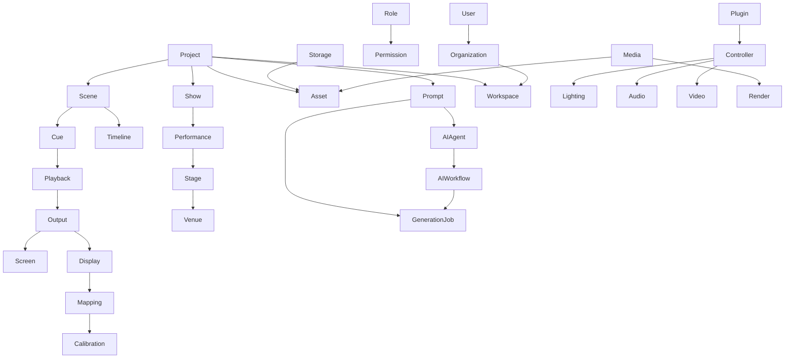

# BOUNDED_CONTEXT

## Core Context

### Project Context
- Responsibility: 프로젝트 생명주기/상태 관리
- Owned Entities: Project, Show
- Owned Services: ProjectService
- Events: ProjectCreated, ProjectClosed
- Commands: CreateProject, UpdateProject, CloseProject
- Queries: GetProject, ListProjects
- External Dependencies: none
- Related Contexts: Scene, Asset, Prompt
- Public API: `/projects`
- Future Expansion: Organization/User context 연동

### Show Context
- Responsibility: 공연 회차/버전 관리
- Owned Entities: Show
- Owned Services: ShowService
- Events: ShowCreated, ShowUpdated
- Commands: CreateShow, UpdateShow
- Queries: GetShow, ListShows
- External Dependencies: Project Context
- Related Contexts: Scene, Performance
- Public API: `/shows`
- Future Expansion: 공연장/공연일시 연동

### Scene Context
- Responsibility: 장면 CRUD/정렬 관리
- Owned Entities: Scene
- Owned Services: SceneService
- Events: SceneCreated, SceneRenamed, SceneReordered
- Commands: CreateScene, RenameScene, ReorderScene
- Queries: ListScenes
- External Dependencies: Project Context
- Related Contexts: Cue, Asset, Timeline
- Public API: `/scenes`
- Future Expansion: Timeline/Playback 연동

### Timeline Context
- Responsibility: 장면/큐 실행 순서 관리
- Owned Entities: Sequence, Transition
- Owned Services: TimelineService
- Events: TimelinePublished, TimelineExecuted
- Commands: PublishTimeline, ExecuteTimeline
- Queries: GetTimeline, ListTimelines
- External Dependencies: Scene Context
- Related Contexts: Sequence, Cue
- Public API: `/timelines`
- Future Expansion: 자동 실행/동기화

### Cue Context
- Responsibility: 실행 지점 관리
- Owned Entities: Cue
- Owned Services: CueService
- Events: CueTriggered, CueDone
- Commands: TriggerCue, CompleteCue
- Queries: ListCues, GetCue
- External Dependencies: Scene Context
- Related Contexts: Action, Playback
- Public API: `/cues`
- Future Expansion: 컨트롤러 자동 실행

### Asset Context
- Responsibility: 자산/미디어 관리
- Owned Entities: Asset, Media
- Owned Services: AssetService
- Events: AssetRegistered, AssetRetired
- Commands: RegisterAsset, RetireAsset
- Queries: ListAssets, GetAsset
- External Dependencies: Project Context
- Related Contexts: Render, Library
- Public API: `/assets`
- Future Expansion: 썸네일/버전/태그

### Playback Context
- Responsibility: 재생 제어/상태 추적
- Owned Entities: Playback
- Owned Services: PlaybackService
- Events: PlaybackStarted, PlaybackFinished
- Commands: StartPlayback, StopPlayback
- Queries: GetPlaybackStatus
- External Dependencies: Timeline Context, Cue Context
- Related Contexts: Output
- Public API: `/playbacks`
- Future Expansion: 싱크/리허설 모드

### Output Context
- Responsibility: 출력 대상 관리
- Owned Entities: Output, Screen, Projector, Display
- Owned Services: OutputService
- Events: OutputCreated, OutputDisabled
- Commands: CreateOutput, DisableOutput
- Queries: ListOutputs, GetOutput
- External Dependencies: Scene Context
- Related Contexts: Mapping, Calibration
- Public API: `/outputs`
- Future Expansion: 다중 출력 라우팅

### Plugin Context
- Responsibility: 플러그인 등록/상태 관리
- Owned Entities: Plugin
- Owned Services: PluginService
- Events: PluginRegistered, PluginLoaded, PluginDisabled
- Commands: RegisterPlugin, LoadPlugin, DisablePlugin
- Queries: ListPlugins, GetPlugin
- External Dependencies: Workspace Context
- Related Contexts: IntegrationProfile, Controller
- Public API: `/api/plugins`
- Future Expansion: 플러그인 마켓

### Workspace Context
- Responsibility: 작업 환경 관리
- Owned Entities: Workspace
- Owned Services: WorkspaceService
- Events: WorkspaceCreated, WorkspaceArchived
- Commands: CreateWorkspace, ArchiveWorkspace
- Queries: ListWorkspaces, GetWorkspace
- External Dependencies: Project Context
- Related Contexts: Plugin, Organization
- Public API: `/workspaces`
- Future Expansion: 팀/권한/SSO

## AI Context

### Prompt Context
- Responsibility: 프롬프트 템플릿/버전 관리
- Owned Entities: Prompt, PromptTemplate
- Owned Services: PromptService
- Events: PromptCreated, PromptUpdated
- Commands: CreatePrompt, UpdatePromptTemplate
- Queries: ListPrompts, GetPrompt
- External Dependencies: Project Context
- Related Contexts: AI Agent, GenerationJob
- Public API: `/prompts`
- Future Expansion: 변수 매핑/템플릿

### AI Agent Context
- Responsibility: 자동화/생성 에이전트 관리
- Owned Entities: AIAgent
- Owned Services: AIAgentService
- Events: AgentStarted, AgentStopped
- Commands: StartAgent, StopAgent
- Queries: ListAgents, GetAgentStatus
- External Dependencies: Prompt Context, Plugin Context
- Related Contexts: GenerationJob
- Public API: `/agents`
- Future Expansion: 멀티 에이전트 오케스트레이션

### AI Workflow Context
- Responsibility: 생성/동기화 워크플로 정의/실행
- Owned Entities: Workflow
- Owned Services: AIWorkflowService
- Events: WorkflowStarted, WorkflowCompleted
- Commands: StartWorkflow, RetryWorkflow
- Queries: GetWorkflowStatus, ListWorkflows
- External Dependencies: Prompt Context, Plugin Context
- Related Contexts: GenerationJob, Synchronization
- Public API: `/workflows`
- Future Expansion: 시각적 파이프라인 편집기

### AI Memory Context
- Responsibility: 생성 이력/컨텍스트 기억 관리
- Owned Entities: Memory
- Owned Services: AIMemoryService
- Events: MemoryStored, MemoryRetrieved
- Commands: StoreMemory, SearchMemory
- Queries: SearchMemory, GetMemory
- External Dependencies: Prompt Context
- Related Contexts: AI Agent, AI Workflow
- Public API: `/memory`
- Future Expansion: RAG/벡터 스토어 연동

## Infrastructure Context

### Authentication Context
- Responsibility: 인증/권한 관리
- Owned Entities: Permission
- Owned Services: AuthService
- Events: UserAuthenticated, UserAuthorized
- Commands: Login, Logout, IssueToken
- Queries: GetCurrentUser, ListPermissions
- External Dependencies: Organization Context
- Related Contexts: User, Role
- Public API: `/auth`
- Future Expansion: SSO/OAuth

### Organization Context
- Responsibility: 조직/멤버 관리
- Owned Entities: Organization
- Owned Services: OrganizationService
- Events: OrganizationCreated, MemberAdded
- Commands: CreateOrganization, AddMember
- Queries: GetOrganization, ListMembers
- External Dependencies: Authentication Context
- Related Contexts: Workspace, User
- Public API: `/organizations`
- Future Expansion: 과금/팀 정책

### Storage Context
- Responsibility: 파일/자산 저장소 관리
- Owned Entities: Storage
- Owned Services: StorageService
- Events: FileUploaded, FileRemoved
- Commands: UploadFile, RemoveFile
- Queries: GetFileUrl, ListFiles
- External Dependencies: Asset Context
- Related Contexts: Media, Asset
- Public API: `/storage`
- Future Expansion: 클라우드/로컬 분리

### Media Context
- Responsibility: 포맷/변환/스펙 관리
- Owned Entities: MediaSpec
- Owned Services: MediaService
- Events: MediaConverted, MediaValidated
- Commands: ConvertMedia, ValidateMedia
- Queries: GetMediaSpec, ListMediaSpecs
- External Dependencies: Asset Context
- Related Contexts: Asset, Render
- Public API: `/media`
- Future Expansion: 자동 썸네일/인코딩

### Synchronization Context
- Responsibility: 디바이스/서비스 시간 동기화
- Owned Entities: SyncSession
- Owned Services: SynchronizationService
- Events: SyncStarted, SyncCompleted, SyncFailed
- Commands: StartSync, StopSync
- Queries: GetSyncStatus, ListSyncHistory
- External Dependencies: Plugin Context
- Related Contexts: Timeline, Controller
- Public API: `/sync`
- Future Expansion: NTP/MTC 자동 동기화

### Configuration Context
- Responsibility: 설정/환경 관리
- Owned Entities: Config
- Owned Services: ConfigurationService
- Events: ConfigUpdated, ConfigRolledBack
- Commands: UpdateConfig, RollbackConfig
- Queries: GetConfig, ListConfigHistory
- External Dependencies: Plugin Context
- Related Contexts: Workspace, Plugin
- Public API: `/config`
- Future Expansion: 환경별 설정/버전 관리

## Context Relationship

## Dependency Rule
- Context는 최소 의존성만 가진다.
- 순환 참조 금지.
- Context 간 통신은 Event 또는 Public API 사용.

## Context Ownership
- Scene Entity Owner: Scene Context
- Asset Entity Owner: Asset Context

## Integration Rule
- Context 간 직접 Database 접근 금지.
- Context 간 내부 Model 공유 금지.
- DTO 또는 Event 사용.

## AI Rule
- 모든 AI는 동일한 Context 기준으로 작업한다.
- 새로운 Context 생성은 CTO 승인 후 가능하다.

## Acceptance Criteria
- 모든 Domain이 하나의 Context에만 속한다.
- Context 간 책임이 명확하다.
- Context Diagram이 포함된다.
- Claude가 Context를 기준으로 개발을 시작할 수 있다.

## Completion Definition
- Sprint 2 Context 설계 완료
- Aggregate 설계 시작 가능 상태
